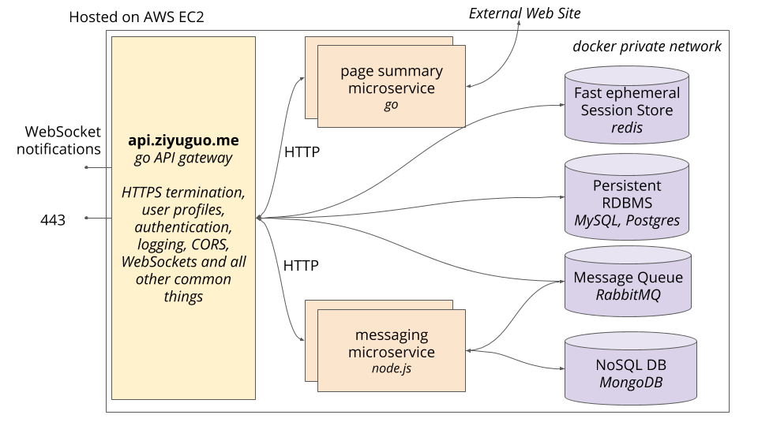

# Ziyu's Server Side Project

•	This repo includes both front-end and back-end of a chat web application (similar to Slack) using an API gateway-based microservice architecture and deployed both client and server to cloud on AWS EC2 instances.

•	The Golang API gateway handles HTTPS termination, authentication, authorization, session management, Websocket connections with clients.
 
•	The messaging microservice exposes REST APIs for CRUD operations for messages and channels.

•	A trie data structure is implemnted to index all user profiles and enable instant search suggestions as user types in search bar

The diagram below displays the basic architecture of the system.

